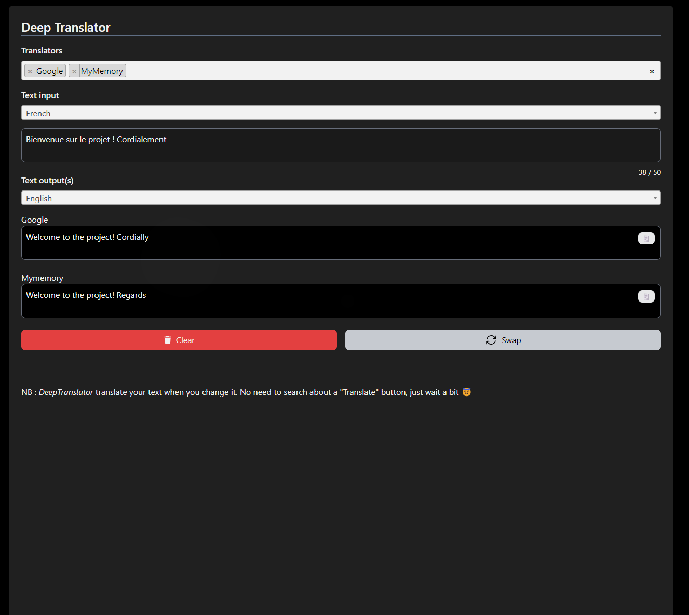

# Deep-translator website

---

## Description
Django-tailwind Website for deep-translator project : https://github.com/nidhaloff/deep-translator


## Features
- ✅ Choose among Google, Microsoft, DeepL, Pons, Yandex, Linguee, MyMemory, Papago, Qcri
- ✅ Swap languages
- ✅ Compare translations from different providers
- ✅ Plan the music everyday by panel Admin
- ⬜️ Translate files
- ⬜️ See differents translations from same provider
- ⬜️ Vocal pronunciation
- ⬜️ Dynamic language detection
- And check all open [issues](https://github.com/nidhaloff/deep-translator-website) or even submit yours !

---

## Installation

### Clone repo
Clone git repo
```bash
git clone https://github.com/nidhaloff/deep-translator-website.git
```

---

### Create virtual env and install dependencies
To create a virtual environment, go to folder translator-website, and type in cmd :
```bash
python3 -m venv translator-env
```
- For Windows users, type :
    ```bash
    translator-env\Scripts\activate.bat
    ```
- For Mac/Linux users, type :
    ```bash
    source translator-env/bin/activate
    ```
Then, install dependencies :

Stay in translator-website folder, and type in cmd :
```bash
python3 -m pip install -r ./requirements.txt
```

### Start project
To start tailwind, cmd : 
```bash
python3 manage.py tailwind start
```
To dev, in another cmd :
```bash
python3 manage.py runserver
```

---

## Troubleshooting 
Some known issues :
- If you have an error with npm, try to install it and add it to setting.py file in NPM_BIN_PATH variable :
```bash
NPM_BIN_PATH = 'C:\\Program Files\\nodejs\\npm.cmd'
```

---

## License
[MIT](https://choosealicense.com/licenses/mit/)

## Author
@TonyBionda and @ArthurGOSSEL1

Enjoy !
